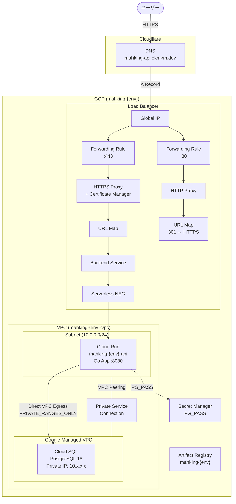
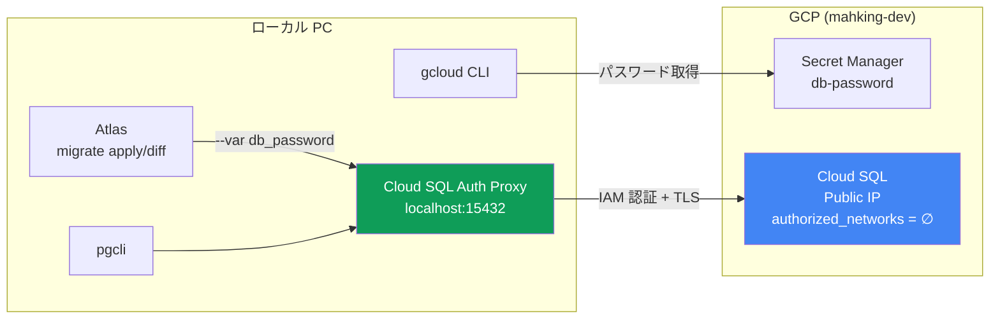
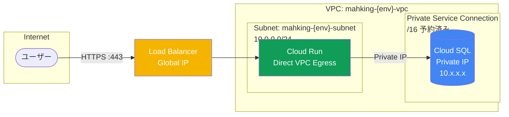
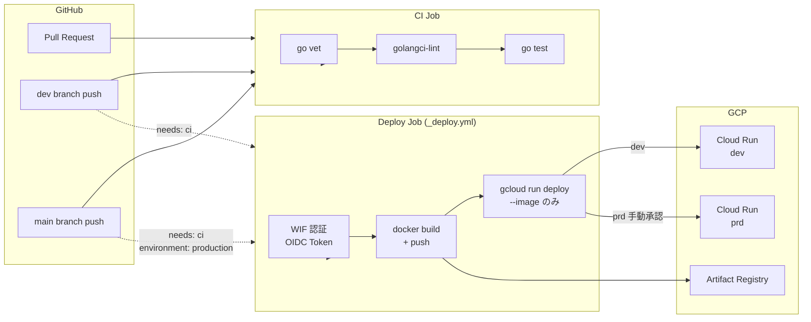
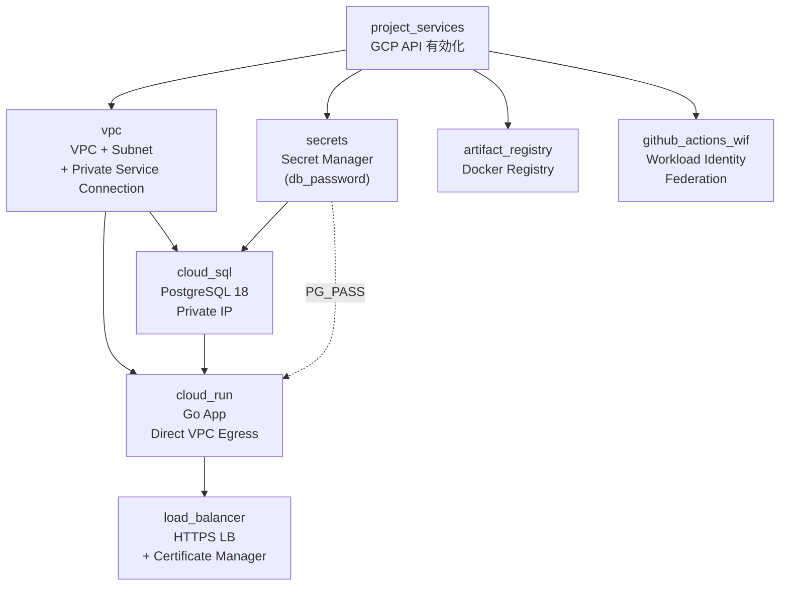
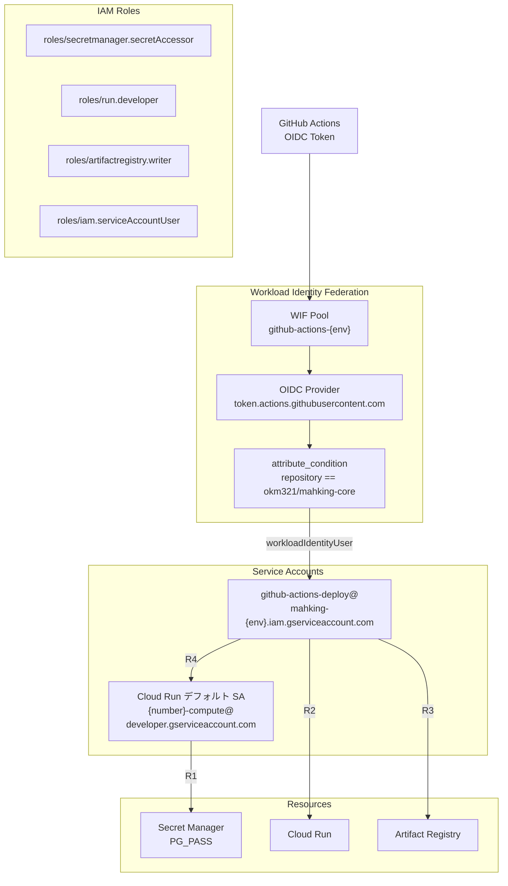

# Architecture

## 全体構成



## ローカル開発（マイグレーション）



- dev のみ Public IP を有効化（`authorized_networks = []` で直接アクセスは全拒否）
- Auth Proxy が IAM 認証で Cloud SQL に接続
- prd は Private IP のみ（ローカルからのアクセス不可）

## ネットワーク構成



## CI/CD パイプライン



## Terraform モジュール依存関係



## IAM 構成



## ディレクトリ構成

```
mahking-core/
├── go/                           # Go アプリケーション
│   ├── cmd/server/               # エントリーポイント
│   ├── internal/                 # 内部パッケージ
│   ├── pkg/                      # 共有パッケージ
│   ├── Dockerfile                # マルチステージビルド
│   ├── Makefile                  # build / deploy / release
│   └── .golangci.yml             # linter 設定
├── .github/workflows/
│   ├── ci.yml                    # PR → lint + test
│   ├── _deploy.yml               # reusable deploy workflow
│   ├── deploy-dev.yml            # dev push → CI + deploy
│   └── deploy-prd.yml            # main push → CI + deploy (手動承認)
├── ops/db/                       # DB マイグレーション
│   ├── atlas.hcl                 # Atlas 設定 (local / dev)
│   ├── schema/                   # スキーマ定義
│   ├── migrations/               # マイグレーションファイル
│   └── Makefile                  # proxy / migrate / db-connect
└── ops/terraform/gcp/
    ├── dev/                      # dev 環境
    ├── prd/                      # prd 環境
    └── modules/
        ├── artifact_registry/    # Docker Registry
        ├── cloud_run/            # Cloud Run
        ├── cloud_sql/            # Cloud SQL (PostgreSQL)
        ├── github_actions_wif/   # Workload Identity Federation
        ├── load_balancer/        # HTTPS Load Balancer
        ├── project_services/     # GCP API 有効化
        ├── secret_manager/       # Secret Manager
        └── vpc/                  # VPC + Subnet + PSC
```

## 環境比較

| 設定 | dev | prd |
|-----|-----|-----|
| **Project** | mahking-dev | mahking-prd |
| **Cloud SQL** | db-f1-micro / 10GB | db-custom-1-3840 / 20GB |
| **Cloud SQL Public IP** | ON（Auth Proxy 用） | OFF |
| **Cloud SQL Backup** | OFF | ON |
| **Cloud SQL 削除保護** | OFF | ON |
| **Cloud Run CPU/Mem** | 1 / 512Mi | 2 / 1Gi |
| **Cloud Run Instances** | 0-10 | 1-100 |
| **CDN** | OFF | ON |
| **Deploy 承認** | 自動 | 手動 (environment: production) |
| **Subnet CIDR** | 10.0.0.0/24 | 10.1.0.0/24 |
| **Domain** | mahking-api.okmkm.dev | TBD |
